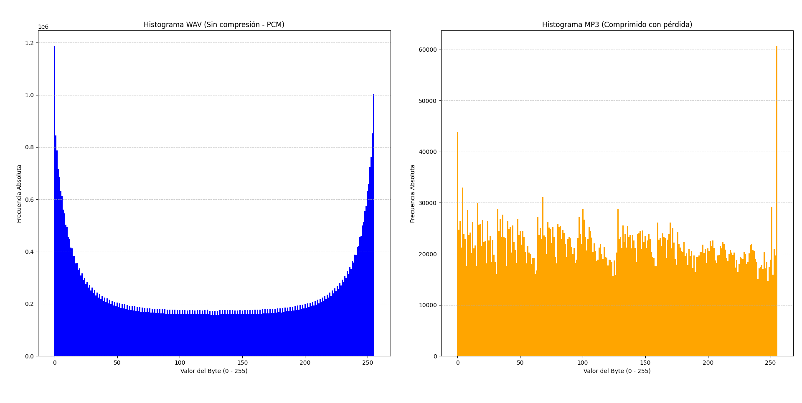

# Práctico de Máquina 1: Análisis de Audio (WAV vs. MP3)

## 1. ¿De qué trata este trabajo?

El objetivo de esta actividad es comparar cómo se guardan los datos de audio en dos formatos diferentes:
- **WAV:** Es audio sin comprimir (las muestras de sonido se guardan tal cual se graban).
- **MP3:** Es audio comprimido (reduce mucho el tamaño del archivo quitando datos repetitivos y cosas que el oído humano no llega a percibir).

Para ver esto en la práctica y entender cómo influye el tipo de sonido, probamos 3 audios bien diferentes (cada uno con su versión en `.wav` y en `.mp3`):
1. **Himno Nacional Argentino** (`himno-nacional-argentino.wav` y `.mp3`): Grabación de una orquesta completa, con muchos instrumentos sonando al mismo tiempo (grabado en 24 bits).
2. **Sillycat Shore** (`Sillycat_Shore.wav` y `.mp3`): Música estilo retro / 8-bit (chiptune), con sonidos sintetizados más simples y notas repetitivas (grabado en 16 bits).
3. **Voz Hablada** (`persona.wav` y `.mp3`): Una persona hablando, con pausas naturales y silencios entre palabras (grabado en 16 bits).

El programa en Python (`Actividad1.py`) hace lo siguiente:
1. Revisa que existan los 3 pares de archivos en la carpeta.
2. Lee la cabecera de cada archivo WAV (los primeros 44 bytes) para ver datos como la frecuencia de muestreo y si es estéreo.
3. Cuenta cuántas veces aparece cada uno de los 256 valores posibles de un byte (del 0 al 255).
4. Genera un gráfico comparativo con los histogramas de todos los archivos (`Histograma.png`).
5. Calcula la **Entropía de Shannon** para medir la redundancia y ver cuánta información se pierde o reordena al comprimir.

---

## 2. ¿Qué necesitamos para ejecutarlo?

El script está hecho en **Python 3**.

### Librerías necesarias
- **Librería externa a instalar:**
  - `matplotlib`: Se usa para dibujar los gráficos de los histogramas.
- **Librerías propias de Python (ya vienen con Python):**
  - `os`: Para verificar que los archivos existan en la carpeta.
  - `math`: Para calcular el logaritmo en base 2 de la fórmula de entropía.
  - `struct`: Para leer los bytes de la cabecera WAV de forma ordenada.
  - `collections`: Usa `Counter` para contar de manera rápida cuántas veces aparece cada byte.

---

## 3. Instalación

Solo hay que instalar la librería `matplotlib`. Abrí una terminal o consola y ejecutá:

```bash
pip install matplotlib
```

---

## 4. Cómo ejecutar el script

1. Abrí la terminal y parate en la carpeta de la Actividad 1:
   ```bash
   cd PracticoDeMaquina/Actividad-1
   ```
2. Ejecutá el programa con Python:
   ```bash
   python Actividad1.py
   ```
3. **¿Qué vas a ver al ejecutarlo?**
   - En la consola se verifica cada archivo, se muestran los datos de la cabecera de cada WAV y aparece una tabla resumen comparando tamaños, compresión y entropías.
   - Se abre y se guarda una imagen con 6 gráficos (`Histograma.png`), mostrando el histograma de cada archivo frente a frente.

---

## 5. Explicación sencilla de cómo funciona el código

El archivo `Actividad1.py` está organizado en funciones simples:

* `validar_archivos`: Revisa que los archivos existan en la carpeta y que terminen en `.wav` y `.mp3`.
* `analizar_cabecera_wav`: Lee los primeros 44 bytes del archivo WAV con la librería `struct` para ver los canales, la frecuencia y los bits por muestra.
* `calcular_probabilidades_y_entropia`: Lee todo el archivo byte por byte. Cuenta cuántas veces aparece cada valor (del 0 al 255) y calcula su probabilidad. Con esos datos aplica la fórmula de Shannon:
  $$H = -\sum p_i \cdot \log_2(p_i)$$
* `graficar_triple_comparativa`: Dibuja los histogramas de los 3 casos frente a frente con `matplotlib` y guarda la imagen en `Histograma.png`.
* `main`: Es la función principal que ejecuta todo el análisis en orden y muestra la tabla resumen.

---

## 6. Respuestas de la Actividad 1

A continuación se detallan las respuestas a los puntos de la guía:

### a) Carga y Validación
El programa comprueba que los archivos existan físicamente en la carpeta y que tengan la extensión correspondiente (`.wav` y `.mp3`). Se probaron 3 pares de audios:
1. `himno-nacional-argentino.wav` y `.mp3`
2. `Sillycat_Shore.wav` y `.mp3`
3. `persona.wav` y `.mp3`

Todos los archivos pasaron la comprobación sin problemas.

### b) Análisis de Cabeceras de los archivos WAV
Al leer los primeros 44 bytes de cada archivo WAV, obtuvimos los siguientes datos técnicos:

| Parámetro técnico | Himno Nacional | Sillycat Shore | Voz Hablada |
| :--- | :---: | :---: | :---: |
| **Identificador (ChunkID)** | `RIFF` | `RIFF` | `RIFF` |
| **Tamaño de datos (ChunkSize)** | `63.647.182 bytes` (~60,7 MB) | `53.154.178 bytes` (~50,7 MB) | `14.918.936 bytes` (~14,2 MB) |
| **Formato contenedor** | `WAVE` | `WAVE` | `WAVE` |
| **Codificación (AudioFormat)** | `1` (PCM lineal sin compresión) | `1` (PCM lineal sin compresión) | `1` (PCM lineal sin compresión) |
| **Canales (NumChannels)** | `2` (Estéreo) | `2` (Estéreo) | `2` (Estéreo) |
| **Frecuencia de muestreo** | `44.100 Hz` | `44.100 Hz` | `48.000 Hz` |
| **Resolución por muestra** | **`24 bits`** | **`16 bits`** | **`16 bits`** |
| **Subchunk2 ID detectado** | `bext` (Metadata de broadcast) | `data` (Datos de sonido) | `data` (Datos de sonido) |

---

### c) Distribución de Probabilidades
Cada archivo se lee byte a byte. Como cada byte puede tomar 256 valores posibles (del 0 al 255), calculamos la probabilidad de cada valor dividiendo la cantidad de veces que aparece entre el total de bytes del archivo:
$$p_i = \frac{n_i}{N}$$

---

### d) Histogramas Comparativos

La siguiente imagen muestra los histogramas de los 3 casos frente a frente: a la izquierda los archivos sin comprimir (WAV) y a la derecha los comprimidos (MP3):

<div align="center">



</div>

* **Archivos WAV (columna izquierda):** En los tres casos se ven picos muy marcados en los extremos (valores cercanos a 0 y 255), que corresponden a silencios o sonidos de bajo volumen. En el caso de la voz humana, el pico en 0 es descomunal porque hay muchas pausas entre palabras.
* **Archivos MP3 (columna derecha):** Los histogramas son mucho más planos y parejos. Casi todos los valores del 0 al 255 aparecen una cantidad similar de veces.

---

### e) Cálculo de Entropía y Resultados

Usando la fórmula de Shannon para cada archivo, obtuvimos los siguientes valores:

| Caso de Estudio | Tipo de Sonido | Bits por muestra | Tamaño WAV | Tamaño MP3 | Reducción de Tamaño | Entropía WAV | Entropía MP3 | Diferencia ($\Delta H$) |
| :--- | :--- | :---: | :---: | :---: | :---: | :---: | :---: | :---: |
| **1. Himno Nacional** | Orquesta (muchos instrumentos) | 24 bits | 60,7 MB | 5,3 MB | **-91,2%** (11,4 a 1) | **$7,80$** | $7,98$ | **$+0,17$** |
| **2. Sillycat Shore** | Música 8-bit / Chiptune | 16 bits | 50,7 MB | 6,5 MB | **-87,3%** (7,9 a 1) | **$7,41$** | $7,98$ | **$+0,57$** |
| **3. Voz Hablada** | Persona hablando con pausas | 16 bits | 14,2 MB | 1,0 MB | **-93,3%** (14,9 a 1) | **$6,50$** | $7,80$ | **$+1,31$** |

> **Recordatorio:** La entropía máxima posible para 256 valores es $\log_2(256) = 8,00 \text{ bits/símbolo}$.

---

### f) Comparación y Explicación

#### ¿Por qué hay tanta diferencia entre un archivo WAV (sin compresión) y uno MP3 (comprimido)?

La diferencia fundamental está en la **redundancia** (la información repetida o predecible) y en cómo la maneja cada formato:

1. **En el archivo WAV (sin compresión):**
   * El formato WAV guarda las ondas de sonido en crudo, tal cual se capturan.
   * En la vida real, los sonidos no cambian bruscamente a cada instante: una nota musical dura varios milisegundos, el volumen sube o baja de forma suave y hay momentos de silencio o pausas.
   * Esto hace que muchísimos bytes seguidos tengan valores repetidos o muy parecidos (por ejemplo, el silencio en audio digital se guarda como una seguidilla constante de ceros).
   * Desde la Teoría de la Información, cuando un dato se repite mucho o es fácil de adivinar, decimos que tiene **alta redundancia** y **baja incertidumbre**. Al haber poca incertidumbre, la **entropía es menor** y el histograma muestra **picos pronunciados** en esos valores repetidos.

2. **En el archivo MP3 (comprimido con pérdida):**
   * El objetivo de comprimir a MP3 es achicar el archivo lo más posible sin que el oído humano note una gran diferencia.
   * Para lograrlo, el algoritmo hace dos cosas principales:
     * **Elimina lo inaudible:** Quita frecuencias muy altas o sonidos débiles que quedan tapados por otros más fuertes (enmascaramiento auditivo).
     * **Elimina la redundancia (Codificación Huffman):** Reorganiza todos los datos para que ningún patrón se repita innecesariamente. A los valores más frecuentes les asigna códigos cortos de bits y a los menos frecuentes códigos más largos.
   * Al quitarle toda la redundancia al audio, los bytes que quedan guardados en el archivo MP3 terminan comportándose prácticamente como **ruido aleatorio**: casi cualquier valor del 0 al 255 tiene la misma probabilidad de salir.
   * Según Shannon, cuando todos los símbolos de una fuente tienen la misma probabilidad (son equiprobables), se alcanza la **máxima entropía posible** ($8,00 \text{ bits}$). Por esta razón, el histograma del MP3 es **plano y parejo**, y su entropía siempre da muy cerca de 8.

---

#### ¿Qué nos enseña la comparativa entre los 3 audios?

La comparación entre los tres audios demuestra que **cuanta más redundancia tiene el sonido original, mayor es la caída de entropía en el WAV y mayor es el salto al comprimirlo**:

* **En el Himno (orquesta):** Como hay decenas de instrumentos tocando todo el tiempo y casi no hay pausas, el WAV ya de por sí es bastante variado y su entropía inicial es alta ($7,80$). Por eso el salto al comprimirlo es chico ($+0,17$). Además, al estar grabado en 24 bits, los bytes de menor peso agregan pequeñas variaciones que suben ese valor.
* **En Sillycat Shore (8-bit):** La música chiptune usa ondas sintetizadas simples (cuadradas o triangulares) y notas repetitivas. El WAV tiene más redundancia, su entropía baja a $7,41$ y el salto al MP3 es más del triple ($+0,57$).
* **En la Voz Hablada:** Es el caso más extremo. Al hablar hacemos pausas constantes entre palabras y oraciones. Cerca del 25% de los bytes del WAV son ceros puros de silencio. Esto hace que la entropía del WAV se desplome a $6,50$. Cuando el MP3 comprime todos esos silencios, el ahorro de espacio supera el **93%** y el salto de entropía es récord (**$+1,31 \text{ bits}$**).
