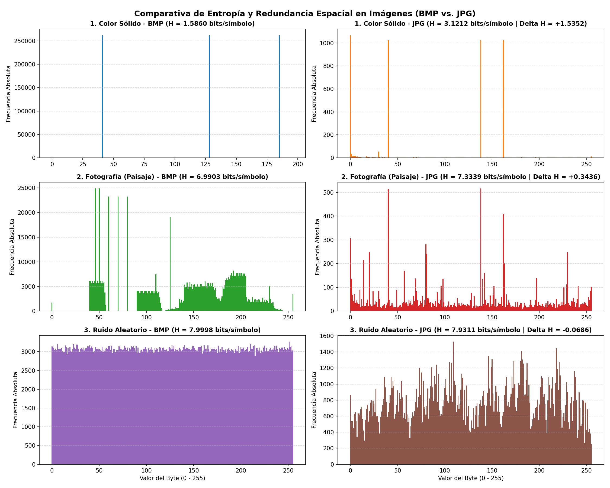

# Práctico de Máquina 1: Actividad 2 — Análisis de Imágenes (BMP vs. JPG)

## 1. ¿De qué trata este trabajo?

En esta actividad comparamos cómo se almacena la información visual en dos formatos de imagen muy comunes:
- **BMP (Bitmap):** Guarda los píxeles en crudo, sin compresión. Cada píxel almacena directamente sus componentes de color (Rojo, Verde y Azul).
- **JPG (JPEG):** Aplica compresión con pérdida. Reduce mucho el tamaño del archivo eliminando detalles finos que el ojo humano no llega a notar y reorganizando los datos con codificación entrópica.

Para entender a fondo el concepto de **redundancia espacial** (cuando píxeles cercanos tienen colores iguales o parecidos), creamos y analizamos 3 pares de imágenes con la misma resolución ($512 \times 512$ píxeles a 24 bits):
1. **Color Sólido (`color_solido.bmp` y `.jpg`):** Toda la imagen es de un solo color azul. Representa la **máxima redundancia espacial posible**.
2. **Fotografía (`foto.bmp` y `.jpg`):** Un paisaje con cielo en gradiente, sol, montañas, agua y pasto. Representa la **redundancia espacial natural** de una foto real.
3. **Ruido Aleatorio (`ruido.bmp` y `.jpg`):** Cada píxel tiene un color completamente aleatorio e independiente de sus vecinos. Representa la **nula redundancia espacial**.

El programa en Python (`Actividad2.py`) hace lo siguiente:
1. Revisa que existan los archivos en la carpeta.
2. Lee los primeros 54 bytes de la cabecera de cada archivo BMP (firma, tamaño, dimensiones y bits por píxel).
3. Cuenta las apariciones de cada byte (del 0 al 255) y calcula su probabilidad.
4. Genera una imagen comparativa con los 6 histogramas (`Histograma.png`).
5. Calcula la **Entropía de Shannon** para medir el grado de desorden y redundancia en cada caso.

---

## 2. ¿Qué necesitamos para ejecutarlo?

El proyecto utiliza **Python 3**.

### Librerías necesarias
- **Librerías externas a instalar:**
  - `matplotlib`: Para generar los gráficos de los histogramas.
  - `Pillow` (PIL): Para generar las imágenes de prueba.
- **Librerías estándar (ya incluidas en Python):**
  - `os`: Para verificar rutas y tamaños de archivo.
  - `math`: Para calcular el logaritmo en base 2 de la entropía.
  - `struct`: Para leer los bytes de la cabecera BMP de forma ordenada.
  - `collections`: Usa `Counter` para contar rápidamente la frecuencia de cada byte.

---

## 3. Instalación

Si no tenés instaladas las librerías necesarias, abrí una consola y ejecutá:

```bash
pip install matplotlib pillow
```

---

## 4. Cómo ejecutar el script

1. Abrí la terminal y parate en la carpeta de la Actividad 2:
   ```bash
   cd PracticoDeMaquina/Actividad-2
   ```

2. *(Opcional)* Si querés regenerar las imágenes de prueba desde cero:
   ```bash
   python generar_imagenes.py
   ```

3. Ejecutá el análisis principal:
   ```bash
   python Actividad2.py
   ```

4. **¿Qué vas a ver al ejecutarlo?**
   - En la consola se comprueban los archivos, se imprime la cabecera técnica de 54 bytes de cada BMP y aparece una tabla resumen comparando tamaños en KB, porcentaje de compresión y entropías.
   - Se abre y se guarda una imagen con 6 gráficos (`Histograma.png`) comparando los histogramas de cada caso frente a frente.

---

## 5. Explicación sencilla de cómo funciona el código

El script `Actividad2.py` está organizado en funciones modulares:

* `validar_archivos`: Comprueba que los archivos existan en el disco y tengan las extensiones correspondientes (`.bmp` y `.jpg`).
* `analizar_cabecera_bmp`: Lee los primeros 54 bytes del archivo BMP usando la librería `struct` con el formato `'<2sIHHI IiiHHIIiiII'`:
  - **14 bytes de archivo:** Revisa la firma `"BM"`, el tamaño total reportado y el offset donde arrancan los datos de los píxeles (byte 54).
  - **40 bytes de información DIB:** Extrae ancho, alto, cantidad de planos (1), profundidad de color (24 bits) y tipo de compresión (0 = sin compresión).
* `calcular_probabilidades_y_entropia`: Lee todo el archivo byte por byte. Cada byte toma un valor entre 0 y 255. Cuenta las ocurrencias de cada valor y calcula su probabilidad $p_i = n_i / N$. Luego aplica la fórmula de Shannon:
  $$H = -\sum_{i=0}^{255} p_i \cdot \log_2(p_i)$$
* `graficar_histogramas_comparativos`: Dibuja los histogramas de los 3 casos frente a frente con `matplotlib` (columna izquierda BMP, columna derecha JPG) y guarda la figura en `Histograma.png`.
* `main`: Coordina la ejecución completa e imprime la tabla comparativa final en la consola.

---

## 6. Respuestas de la Actividad 2

### a) Carga y Validación
El programa comprueba que los archivos existan físicamente y tengan la extensión esperada (`.bmp` y `.jpg`). Se validaron los 3 pares de imágenes ($512 \times 512$ píxeles):
1. `color_solido.bmp` y `color_solido.jpg`
2. `foto.bmp` y `foto.jpg`
3. `ruido.bmp` y `ruido.jpg`

Todos los archivos pasaron la comprobación sin errores.

---

### b) Análisis de Cabecera del archivo BMP
Al leer los primeros 54 bytes de los archivos BMP se obtuvieron los siguientes datos técnicos:

| Campo de la Cabecera | Tamaño | Valor Obtenido | Explicación |
| :--- | :---: | :---: | :--- |
| **Firma (Signature)** | 2 bytes | `BM` | Identifica que es un archivo Bitmap de Windows (0x42 0x4D en hexadecimal). |
| **Tamaño del archivo (FileSize)** | 4 bytes | `786.486 bytes` | Tamaño total: 54 bytes de cabecera + $512 \times 512 \times 3 = 786.432$ bytes de píxeles. |
| **Desplazamiento (DataOffset)** | 4 bytes | `54 bytes` | Indica en qué byte arrancan los píxeles (justo después de la cabecera). |
| **Tamaño cabecera DIB (Size)** | 4 bytes | `40 bytes` | Confirma el estándar `BITMAPINFOHEADER`. |
| **Anchura (Width)** | 4 bytes | `512 píxeles` | Ancho de la imagen. |
| **Altura (Height)** | 4 bytes | `512 píxeles` | Alto de la imagen. |
| **Planos (Planes)** | 2 bytes | `1` | Cantidad de planos de color (siempre es 1). |
| **Bits por píxel (BitCount)** | 2 bytes | `24 bits` | Color verdadero (True Color): 1 byte para Azul, 1 para Verde y 1 para Rojo por píxel. |
| **Compresión (Compression)** | 4 bytes | `0 (BI_RGB)` | Significa que los píxeles están en crudo, sin compresión. |
| **Tamaño datos imagen (ImageSize)**| 4 bytes | `786.432 bytes` | Coincide exactamente con $512 \times 512 \times 3$ bytes de datos brutos. |

---

### c) Distribución de Probabilidades
Cada archivo se procesó como una secuencia de bytes sobre un alfabeto de 256 símbolos (valores del 0 al 255). La probabilidad de cada byte se calculó dividiendo la cantidad de veces que aparece ($n_i$) entre el total de bytes del archivo ($N$):
$$p_i = \frac{n_i}{N}$$

---

### d) Histogramas Comparativos

La siguiente imagen muestra la comparativa visual completa en una cuadrícula $3 \times 2$:

<div align="center">



</div>

* **Columna Izquierda (BMP - Sin compresión):**
  * **1. Color Sólido:** Muestra únicamente **3 líneas verticales aisladas**, correspondientes a los 3 valores de color que forman el azul usado (Rojo 41, Verde 128 y Azul 185). Los 253 valores restantes casi no aparecen.
  * **2. Fotografía:** Muestra **picos y montañas muy definidos** que corresponden a los colores predominantes del paisaje (el celeste del cielo, el azul oscuro del lago, el verde del pasto y el amarillo del sol).
  * **3. Ruido Aleatorio:** Es una **barra horizontal completamente pareja y plana**. Todos los valores del 0 al 255 aparecen prácticamente la misma cantidad de veces (~3.070 repeticiones cada uno).
* **Columna Derecha (JPG - Comprimido con pérdida):**
  * En los tres casos, la compresión JPEG reorganiza y mezcla los datos, dispersando los bytes a lo largo del espectro.

---

### e) Cálculo de Entropía y Resultados

Aplicando la fórmula de Shannon a cada archivo, obtuvimos los siguientes valores:

| Caso de Estudio | Tipo de Imagen | Tamaño BMP | Tamaño JPG | Reducción | Ratio de Compresión | Entropía BMP | Entropía JPG | Diferencia ($\Delta H$) |
| :--- | :--- | :---: | :---: | :---: | :---: | :---: | :---: | :---: |
| **1. Color Sólido** | Un solo color azul uniforme | 768,1 KB | 4,6 KB | **-99,4%** | **166,45 : 1** | **$1,5860$** | $3,1212$ | **$+1,5352$** |
| **2. Fotografía** | Paisaje con gradientes y formas | 768,1 KB | 11,9 KB | **-98,4%** | **64,41 : 1** | **$6,9903$** | $7,3339$ | **$+0,3436$** |
| **3. Ruido Aleatorio**| Píxeles aleatorios independientes | 768,1 KB | 194,1 KB | **-74,7%** | **3,96 : 1** | **$7,9998$** | $7,9311$ | **$-0,0686$** |

---

### f) Comparación y Explicación

#### ¿Por qué el archivo BMP presenta picos y el archivo JPG presenta una distribución mucho más uniforme?

La explicación radica en el concepto de **redundancia espacial** y en la forma en que cada formato guarda la imagen:

1. **En el archivo BMP (Redundancia Espacial en crudo):**
   * El formato BMP guarda los píxeles directamente uno tras otro.
   * En cualquier imagen real (como una fotografía o un fondo de color), existe una fuerte **correlación espacial**: un píxel tiende a tener un color muy similar al de los píxeles vecinos (por ejemplo, si un píxel es parte del cielo, los píxeles de al lado casi seguro también son celestes).
   * Esto significa que ciertos valores de bytes se repiten millones de veces en el archivo, mientras que otros valores casi no aparecen.
   * En la Teoría de la Información, cuando los datos son predecibles y se repiten, decimos que hay **alta redundancia** y **baja incertidumbre**. Por eso, el histograma de un BMP muestra **picos pronunciados** en los colores frecuentes y la entropía es sensiblemente menor que 8 bits.

2. **En el archivo JPG (Eliminación de Redundancia con DCT y Huffman):**
   * El formato JPG no guarda píxeles sueltos. Divide la imagen en bloques de $8 \times 8$ píxeles y les aplica la **Transformada Coseno Discreta (DCT)**.
   * La DCT convierte los colores espaciales en **frecuencias visuales**: separa los cambios suaves de color (frecuencias bajas) de los detalles finos y bordes (frecuencias altas).
   * Luego aplica dos pasos fundamentales:
     * **Cuantización (pérdida):** Descarta o redondea fuertemente las frecuencias altas que el ojo humano no alcanza a distinguir.
     * **Codificación Huffman (sin pérdida):** Comprime los coeficientes resultantes asignando secuencias cortas de bits a los patrones repetidos y secuencias largas a los raros.
   * Al eliminar la redundancia espacial y empaquetar los bits al máximo, los bytes que quedan guardados en el archivo `.jpg` pierden toda su estructura repetitiva y terminan pareciéndose a **ruido aleatorio**, donde casi todos los valores del 0 al 255 tienen probabilidades similares.
   * Según Shannon, cuando todos los símbolos de un alfabeto son igualmente probables, se alcanza la **máxima entropía posible** ($8,00 \text{ bits}$). Por esta razón, el histograma del JPG es **mucho más plano y parejo**, y su entropía se acerca a su límite superior.

---

#### ¿Qué nos enseña la comparativa entre los 3 tipos de imágenes?

El contraste entre los tres casos demuestra claramente que **la efectividad de la compresión depende por completo de la redundancia espacial de la fuente**:

* **Color Sólido (Redundancia Máxima):** Como todos los píxeles son idénticos, la redundancia espacial es total. La DCT convierte casi todo el bloque a cero y la compresión es brutal: el archivo se achica un **99,4%** (de 768 KB a solo 4,6 KB).
* **Fotografía (Redundancia Natural):** Al haber áreas continuas (cielo, lago, montañas), la compresión aprovecha la correlación entre píxeles vecinos y logra achicar la imagen un **98,4%** (de 768 KB a 11,9 KB) con excelente calidad visual.
* **Ruido Aleatorio (Redundancia Nula):** Como cada píxel fue generado al azar, no hay ninguna relación entre píxeles vecinos. El BMP ya arranca con entropía máxima ($7,9998$). La DCT no encuentra ningún patrón repetitivo para eliminar, por lo que el archivo JPG queda enorme (**194 KB**, es decir, ¡16 veces más pesado que la foto y 42 veces más pesado que el color sólido teniendo exactamente la misma cantidad de píxeles!). Esto prueba de forma concluyente que sin redundancia espacial, los algoritmos de compresión como JPEG pierden casi toda su eficacia.
